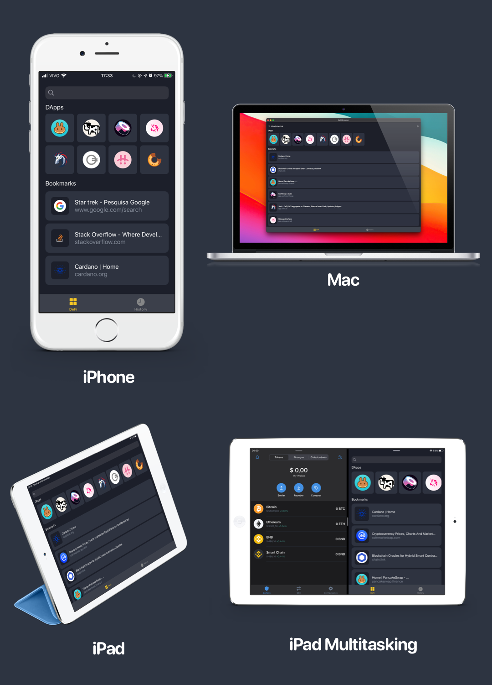

# DeFi-Browser

Small browser to access and bookmark DEFi projects

## FAQ's

1 - How to connect to Trust Wallet?

In the application browser, when accessing a DeFi, use the Connect Wallet button and choose the WalletConnect option, then choose the Trust Wallet or use the QR Code if the wallet is on another device.

> :warning: **Make sure the DeFi website is the oficial one, or you could get hacked and lose all your coins.**: Be very careful here! Make sure you trust the website you are connecting to your wallet.

## License

[MIT License](./LICENSE.md)